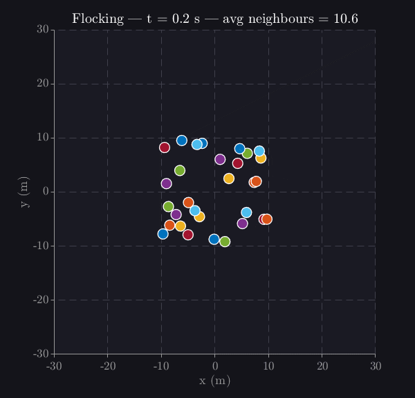

# SwarmSim

**A general-purpose swarm robotics simulation platform in MATLAB.**

SwarmSim is a clean, layered framework for designing, running, and analysing multi-robot swarm experiments. It decouples robot dynamics, collective behaviour algorithms, path planners, and analysis tools so each component can be swapped or extended independently.

---



---

## Features

### Dynamics models

| Model | State | Control |
| --- | --- | --- |
| `SingleIntegrator` | `[x; y]` | velocity `[vx; vy]` |
| `DoubleIntegrator` | `[x; y; vx; vy]` | acceleration `[ax; ay]` |
| `Unicycle` | `[x; y; θ]` | `[v; ω]` |

### Collective behaviours

| Behaviour | Description |
| --- | --- |
| `Aggregation` | All agents converge to swarm centroid |
| `Dispersion` | Agents spread to maximise area coverage |
| `Flocking` | Reynolds boids (separation + alignment + cohesion) |
| `LeaderFollower` | Hierarchical formation with one designated leader |
| `VirtualStructure` | Swarm moves as a single virtual rigid body |
| `PathFollowing` | Track a pre-planned waypoint path |
| `CollisionAvoidance` | Wrapper — adds inter-agent avoidance to any behaviour |
| `FormationWithObstacles` | Wrapper — adds obstacle avoidance to any formation |

### Path planners

| Planner | Algorithm |
| --- | --- |
| `PotentialField` | Gradient descent with local-minima escape |
| `RRT` | Rapidly-exploring Random Tree (probabilistically complete) |
| `AStar` | Grid-based A\* (optimal within grid resolution) |

### Analysis tools

- `DataLogger` — per-step metrics: spread, Fiedler connectivity, kinetic energy
- `MetricsAnalyzer` — convergence time, path length, connectivity ratio
- `ExperimentRunner` — batch runner with comparison bar charts
- `ParamSweep` — parametric sweeps over any scalar parameter
- `PublicationPlot` — 300 DPI figures exported to PDF and PNG

---

## Quick start

**Requirements:** MATLAB R2016b or later. No additional toolboxes required.

```matlab
% 1. Clone the repo and open MATLAB in the project root
%    git clone https://github.com/<your-username>/SwarmSim.git

% 2. Run any scenario directly
run('scenarios/scenario_flocking.m')

% 3. Or build one from scratch in two minutes:
addpath(genpath('.'));

env    = Environment([-30, 30], [-30, 30]);
agents = cellfun(@(i) Agent(i, [randn*10; randn*10; 0; 0], DoubleIntegrator()), ...
                 num2cell(1:20), 'UniformOutput', false);
swarm  = Swarm(agents, 10.0, 'metric');
behav  = Flocking(2.0, 1.0, 1.0);

sim            = SimEngine(swarm, env, behav, 0.1, 30);
sim.visualizer = SwarmVisualizer(swarm, env);
sim.run();
```

---

## Project structure

```text
SwarmSim/
├── core/           Agent, Swarm, Environment, SimEngine, DataLogger, …
├── dynamics/       SingleIntegrator, DoubleIntegrator, Unicycle
├── behaviours/     Aggregation, Dispersion, Flocking, LeaderFollower, …
├── planners/       PotentialField, RRT, AStar
├── visualization/  SwarmVisualizer
├── Tools/          MetricsAnalyzer, ExperimentRunner, ParamSweep, PublicationPlot
├── scenarios/      14 ready-to-run example scripts
├── docs/           Architecture guide, API reference, tutorials
└── dev/            Internal utilities (PackForAi, UnpackFromAI)
```

---

## Architecture

SwarmSim is organised in four independent layers:

```text
┌─────────────────────────────────────────────────┐
│  Tools / Analysis  (MetricsAnalyzer, ParamSweep) │
├─────────────────────────────────────────────────┤
│  Behaviours / Planners  (Flocking, RRT, …)       │
├─────────────────────────────────────────────────┤
│  Core  (SimEngine → Swarm → Agent → Dynamics)    │
├─────────────────────────────────────────────────┤
│  Environment  (obstacles, boundaries, goal)       │
└─────────────────────────────────────────────────┘
```

See [docs/ARCHITECTURE.md](docs/ARCHITECTURE.md) for the full design guide and extension instructions.

---

## Documentation

| Document | Contents |
| --- | --- |
| [docs/ARCHITECTURE.md](docs/ARCHITECTURE.md) | Layer design, data flow, extension guide |
| [docs/API_REFERENCE.md](docs/API_REFERENCE.md) | Every class: constructor, properties, methods |
| [docs/tutorials/01_getting_started.md](docs/tutorials/01_getting_started.md) | Run your first scenario |
| [docs/tutorials/02_build_a_scenario.md](docs/tutorials/02_build_a_scenario.md) | Write a scenario from scratch |
| [docs/tutorials/03_add_a_behavior.md](docs/tutorials/03_add_a_behavior.md) | Implement a custom behaviour |
| [docs/tutorials/04_run_an_experiment.md](docs/tutorials/04_run_an_experiment.md) | Batch experiments and parameter sweeps |

---

## Roadmap

| Status | Feature |
| --- | --- |
| ✅ | 3 dynamics models, 8 behaviours, 3 planners |
| ✅ | Real-time visualisation, publication-quality plots |
| ✅ | Batch experiments, parameter sweeps, CSV export |
| 🔜 | Noise & fault modelling (sensor noise, packet loss, agent failure) |
| 🔜 | PSO and ACO bio-inspired algorithms |
| 🔜 | 3D simulation (quadrotor dynamics, 3D environment) |
| 🔜 | ROS bridge for hardware deployment |
| 🔜 | Python/NumPy port |

---

## Citation

If you use SwarmSim in academic work, please cite:

```bibtex
@software{swarmsim,
  author  = {Goshtasbi, Arshia},
  title   = {{SwarmSim}: A General-Purpose Swarm Robotics Simulation Platform},
  year    = {2024},
  url     = {https://github.com/<your-username>/SwarmSim}
}
```

---

## License

MIT License — see [LICENSE](LICENSE) for details.
